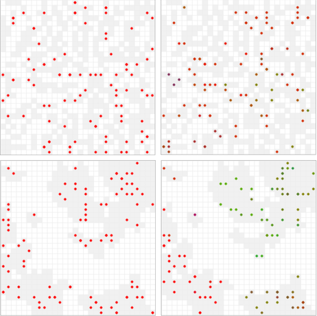

GenFlow 
=======

Un modelo para simular el flujo genético en ambientes fragmentados. Implementado
en `python` 3 con la biblioteca [mesa](https://github.com/projectmesa/mesa).

# Instalación

Para instalar las dependencias ejecutar

```
git clone https://github.com/epedraza/genflow.git
cd genflow 
pip install -r requirements.txt
 ```

# Ejecución 

Una vez realizado esto podemos correr la parte visual del modelo

```
 python run.py
 ```  
y acceder a él a través del navegador en
[http://127.0.0.1:8080](http://127.0.0.1:8080), en él podemos crear distintas
arquitecturas de paisaje y observar como se van diferenciando los individuos
conforme se ejecuta el modelo. Entre otros parámetros podemos ajustar la
distancia de dispersión y el tamaño poblacional. Queda pendiente a futuro
agregar algunos gráficos para visualizar como cambia el sistema :-(.



Los experimentos están codificados en el script `experiment.py`. Los gráficos
del evolución de Fst pueden construirse con la función `plot_experiment` del
script de R `analisis.R` (ver las dependencias dentro del archivo).
